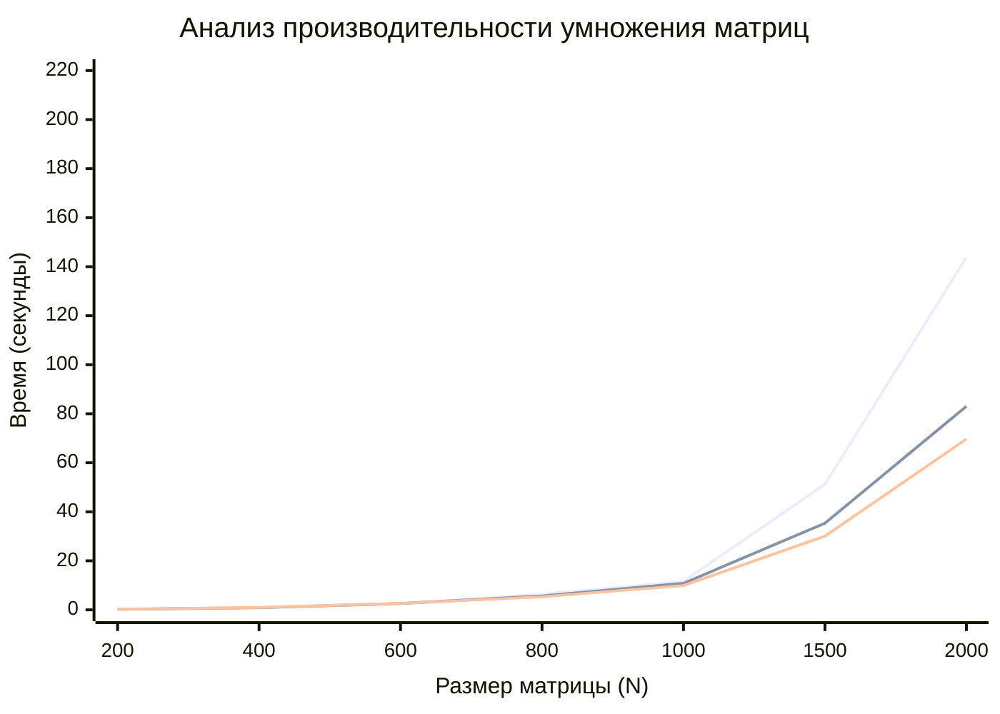

# MatrixMultiplication-using-MPI
Разработка и исследование параллельного алгоритма умножения матриц на основе технологии MPI.
## Алгоритм
Умножение матриц выполняется по классическому алгоритму:
- Входные матрицы: A (size × size), B (size × size)
- Результирующая матрица: C = A × B
- Вычислительная сложность: O(n³)
## Исследование зависимости времени от размера матрицы
### Количество потоков 1:
<table>
  <tr><th>Размер матрицы (N)</th><th>Время обработки (сек.)</th><th>Количество операций (ед.)</th></tr>
  <tr><td>200</td><td>0,087</td><td>16 млн</td></tr>
  <tr><td>400</td><td>0,723</td><td>128 млн</td></tr>
  <tr><td>600</td><td>2,48</td><td>432 млн</td></tr>
  <tr><td>800</td><td>6,39</td><td>1024 млн</td></tr>
  <tr><td>1000</td><td>11,58</td><td>2 млрд</td></tr>
  <tr><td>1500</td><td>51,23</td><td>6,75 млрд</td></tr>
  <tr><td>2000</td><td>143,8</td><td>16 млрд</td></tr>
</table>

### Количество потоков 2:
<table>
  <tr><th>Размер матрицы (N)</th><th>Время обработки (сек.)</th><th>Количество операций (ед.)</th></tr>
  <tr><td>200</td><td>0,21</td><td>16 млн</td></tr>
  <tr><td>400</td><td>0,87</td><td>128 млн</td></tr>
  <tr><td>600</td><td>2,56</td><td>432 млн</td></tr>
  <tr><td>800</td><td>5,67</td><td>1024 млн</td></tr>
  <tr><td>1000</td><td>10,79</td><td>2 млрд</td></tr>
  <tr><td>1500</td><td>35,36</td><td>6,75 млрд</td></tr>
  <tr><td>2000</td><td>83,03</td><td>16 млрд</td></tr>
</table>

### Количество потоков 4:
<table>
  <tr><th>Размер матрицы (N)</th><th>Время обработки (сек.)</th><th>Количество операций (ед.)</th></tr>
  <tr><td>200</td><td>0,24</td><td>16 млн</td></tr>
  <tr><td>400</td><td>0,97</td><td>128 млн</td></tr>
  <tr><td>600</td><td>2,62</td><td>432 млн</td></tr>
  <tr><td>800</td><td>5,31</td><td>1024 млн</td></tr>
  <tr><td>1000</td><td>9,89</td><td>2 млрд</td></tr>
  <tr><td>1500</td><td>30,06</td><td>6,75 млрд</td></tr>
  <tr><td>2000</td><td>69,67</td><td>16 млрд</td></tr>
</table>

# График к полученным данным

## Аппаратные ограничения
Процессор имеет только 2 физических ядра, что ограничивает максимальное ускорение. Использование 4 логических потоков не дает значительного преимущества перед 2 физическими ядрами.

## Вывод
